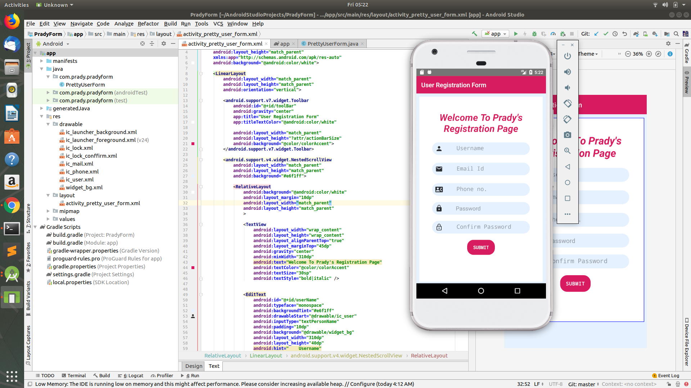
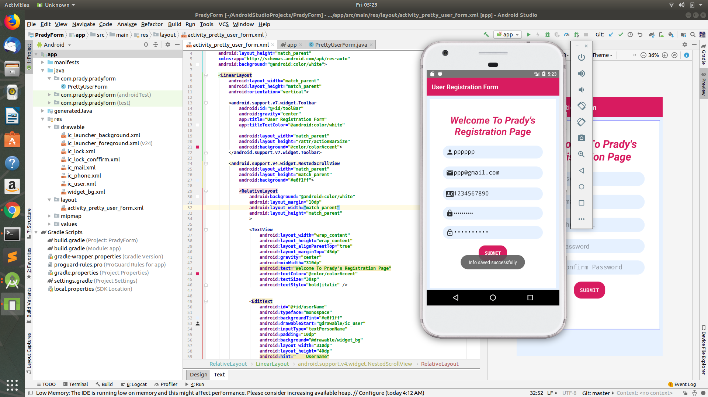

# PradyForm
This is an user registration form android library. 
It stores the user information using sharedPreference. 
The main class in this library has already defined string tags that can be to retrieve 
the user information if it's saved by the activity.

Screenshots:

